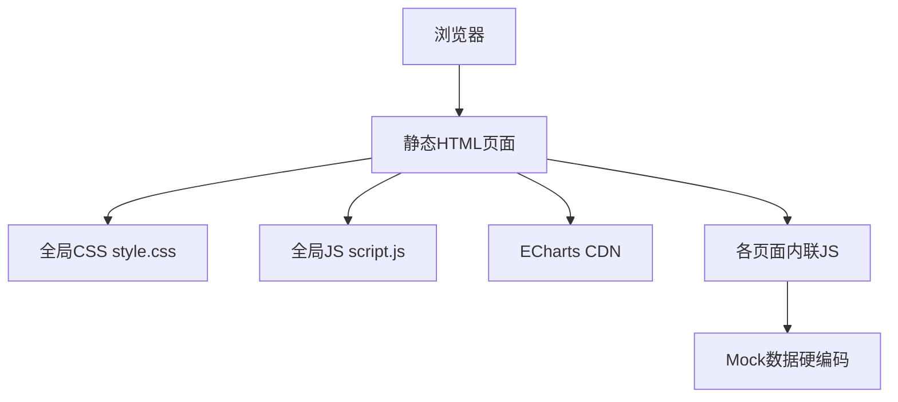

## 1. 架构设计

当前项目为纯前端多页面应用（MPA），采用原生 HTML + CSS + JavaScript 技术栈，无框架、无构建工具、无后端API。

## 2. 技术说明

* 前端：原生 HTML5 + CSS3 + ES5/ES6 JavaScript

* 样式：CSS Variables + 单一全局样式表

* 图表：ECharts 5.4.3（CDN引入）

* 数据层：前端硬编码 Mock 数据

* 无构建工具、无TypeScript、无npm依赖

## 3. PRD差距分析与优化计划

### 3.1 缺失模块（需新建）

| PRD模块   | 当前状态                          | 优化方案                            |
| ------- | ----------------------------- | ------------------------------- |
| M5 财务核算 | 完全缺失（仅approval.html中有简单财务审核区） | 新建 finance.html，含凭证列表、凭证详情、NC推送 |
| M7 系统管理 | 完全缺失                          | 新建 system.html，含系统配置 + 日志查询     |

### 3.2 需优化的现有模块

| PRD模块    | 当前页面                                          | 差距                       | 优化方案             |
| -------- | --------------------------------------------- | ------------------------ | ---------------- |
| M0 首页仪表盘 | investment\_manager.html                      | 缺少异常预警中心、业务流程趋势图不完整      | 补充红黄绿预警模块、完善4个图表 |
| M1 交易管理  | trade.html                                    | 缺少业务部门/投资组字段，计划书表单不完整    | 补充PRD要求的完整字段和校验  |
| M2 产品管理  | product.html + product\_detail.html           | 缺少资产类型/衡泰代码/外部编码/科目映射等字段 | 补充完整PRD字段，入池表单对齐 |
| M3 对手方管理 | counterparty.html + counterparty\_detail.html | 缺少用资计划书上传、入池审批流程         | 补充入池表单和审批关联      |
| M4 审批中心  | approval.html                                 | 缺少对手方入池审批、产品入池审批类型       | 补充完整审批类型和流程时间线   |
| M6 权限管理  | user.html                                     | 已有组织/用户/角色管理，基本完整        | 补充数据隔离规则展示       |

### 3.3 关键业务流程缺失

| PRD流程     | 当前状态 | 优化方案                      |
| --------- | ---- | ------------------------- |
| 产品入池审批流程  | 无    | 在产品入池时增加提交审批环节            |
| 对手方入池审批流程 | 部分有  | 完善入池申请→审批→生效全流程           |
| 交易审批全流程   | 部分有  | 补充投资经理→风控→部门领导→财务确认全链路    |
| 财务核算全流程   | 无    | 新建：交易/净值→凭证生成→确认→XML→推送NC |
| 邮件解析净值更新  | 无    | 在产品详情页增加邮件解析日志和手动处理入口     |

## 4. 路由定义

| 路由                        | 页面       | 说明                |
| ------------------------- | -------- | ----------------- |
| login.html                | 登录页      | 角色选择登录            |
| investment\_manager.html  | 首页仪表盘    | 核心数据概览+待办+预警+图表   |
| trade.html                | 交易管理     | 计划书+交易+合同录入       |
| product.html              | 产品管理     | 产品池列表+入池          |
| product\_detail.html      | 产品详情     | 基础信息+净值+交易+ERP+合同 |
| counterparty.html         | 对手方管理    | 对手方列表+入池          |
| counterparty\_detail.html | 对手方详情    | 基础信息+关联产品+合同      |
| approval.html             | 审批中心     | 全类型审批+财务审核        |
| finance.html              | 财务核算（新增） | 凭证列表+详情+NC推送      |
| user.html                 | 用户管理     | 组织+用户+角色RBAC      |
| system.html               | 系统管理（新增） | 系统配置+日志查询         |

## 5. UI设计优化方向

### 5.1 设计风格

* 主题：深色侧边栏 + 浅色内容区的专业金融系统风格

* 主色：#3B82F6（蓝色）+ #10B981（成功绿）+ #EF4444（危险红）

* 字体：系统字体栈，紧凑排版（13px基础字号）

* 布局：左侧固定导航 + 顶部工具栏 + 内容区卡片式布局

### 5.2 优化要点

* 统一卡片样式，增加阴影层次感

* 优化表格行间距和斑马纹

* 状态徽章增加更丰富的颜色区分

* 数据概览卡片增加图标和渐变背景

* 审批流程时间线增加可视化节点

* 弹窗增加过渡动画

* 预警中心增加红黄绿颜色分级视觉

